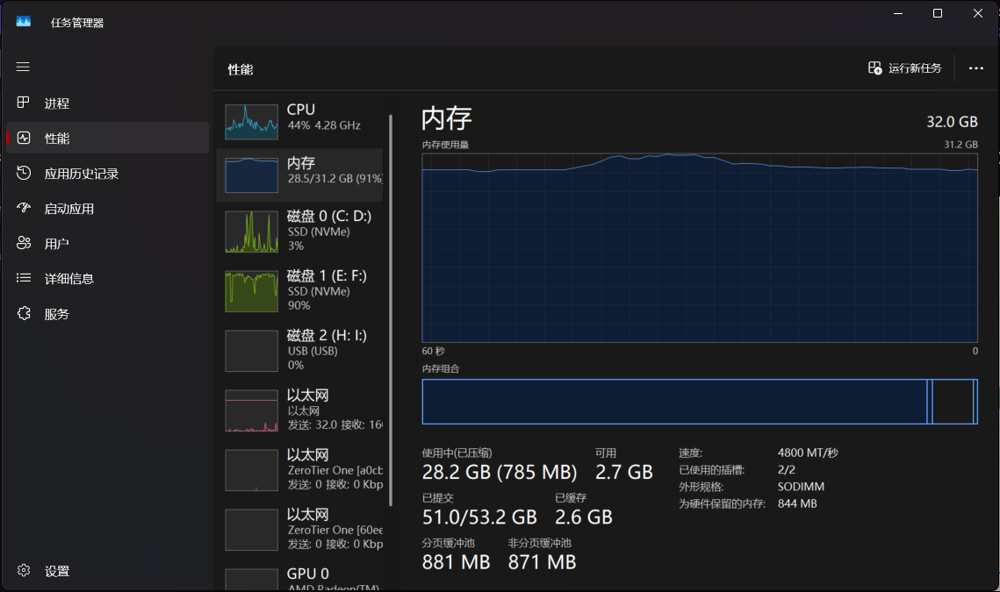
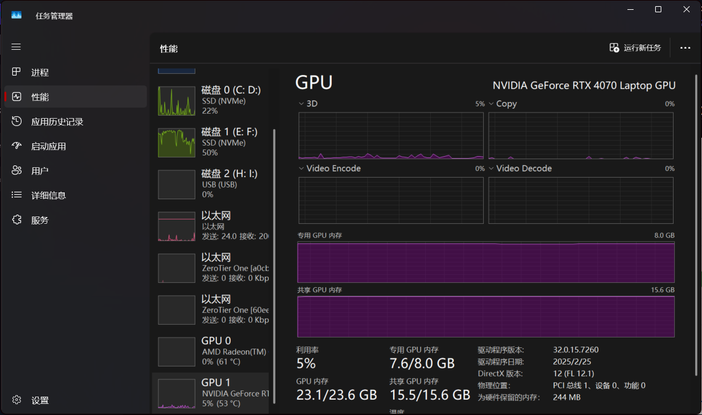

满了...

切换为 Qwen2 的backbone

目前提出假想：

>   这种隐式的概念关联性是否真实存在？比如我询问：告诉我目前A值最高的模型是什么以及它能最高的原因。 这时候 RAG 提供的文档中应该包含 A值 模型评分图标信息 以及 A值的 概念性解释 ： A 是由 B 提出的 基于 C 构建的 D 框评分标准。 而 C 又会有 概念性解释： C 框架依托于 E 具体算法为 F。 这样一个 递归式的解释文档。以及一堆其他 相关领域的各种概念的 文档。 这时候现有 RAG 模型能否发现这一条明确的逻辑线路？ 参考 ColPali 由于存在 公共维度映射 图片信息，只要是 和 A 概念相关领域的 内容 都会有个 较高的 相关分数 它能明确出这一条逻辑线路吗？ 以及我如何评估验证是否存在这一逻辑链 ？

